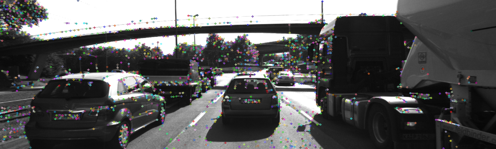
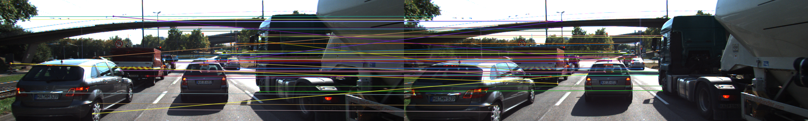
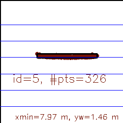
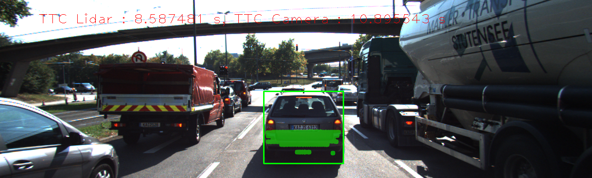

# 3D Object Tracking

To complete this project a solid understanding of keypoint detectors, descriptors, and methods to match 
them between successive images was required. Also,  how to detect objects in an image using the 
YOLO deep-learning framework. 

Finally, regions in a camera image were associated with Lidar points in 3D space. 
The program schematic is presented below.


1. First, 2D keypoints and descripted are obtained with the Shitomasi keypoint detector and with the 
BRISK descriptor respectively. Afterwards. these are matched with See images below for examples. These tasks 
are not part of this project, but have been already completed in the project https://github.com/davidsosa/feature-tracking-2D.

<p>

<p>

<p>
<em>2D keypoints extracted with the Shitomasi detector. Here only 50 points are visualized</em>
</p>

<p>


</p>
<p>
<em>Matching of keypoints with the BRISK descriptor. Here only 50 points are visualized</em>
</p>


1. 3D objects are matched over time by using keypoint correspondences. 

This function can be found here:
https://github.com/davidsosa/object-tracking-3D/blob/master/src/camFusion_Student.cpp#L300

A visualization of the 3D objects inside the ROI can be observed in the following image:
<p>


</p>
<p>
<em>Matching of keypoints with the BRISK descriptor. Here only 50 matched keypoints are visualized</em>
</p>


2. Then TTC measurements are computed based on Lidar measurements.

https://github.com/davidsosa/object-tracking-3D/blob/master/src/camFusion_Student.cpp#L252


3. Then TTC measurements are computed based on camera measurements. This requires to first associate 
keypoint matches to regions of interest and then to compute the TTC based on those matches. 

This is carried out first with the function ```clusterKptMatchesWithROI``` found here:
https://github.com/davidsosa/object-tracking-3D/blob/master/src/camFusion_Student.cpp#L147
which clusters keypoints which have been found in the region of interest in front of the vehicle.

With the keypoint matches calculated the TTC for the camera is carried out here:
https://github.com/davidsosa/object-tracking-3D/blob/master/src/camFusion_Student.cpp#L256

A screenshot of the final results in presented:

<p>


</p>
<p>
<em>TTC estimation for both Lidar and camera.</em>
</p>

## Performance Evaluation 1

If there are Lidar points outside of the car's bumber area, then the Lidar TTC is way off. Therefore it 
is good to consider a larger shrink factor of 0.25 instead of 0.1

## 6. Performance Evaluation 2

The best observed detector/descriptor combinations are: 
SHITOMASI/BRISK
SHITOMASI/BRIEF
SHITOMASI/ORB

## Dependencies for Running Locally
* cmake >= 2.8
  * All OSes: [click here for installation instructions](https://cmake.org/install/)
* make >= 4.1 (Linux, Mac), 3.81 (Windows)
  * Linux: make is installed by default on most Linux distros
  * Mac: [install Xcode command line tools to get make](https://developer.apple.com/xcode/features/)
  * Windows: [Click here for installation instructions](http://gnuwin32.sourceforge.net/packages/make.htm)
* Git LFS
  * Weight files are handled using [LFS](https://git-lfs.github.com/)
* OpenCV >= 4.1
  * This must be compiled from source using the `-D OPENCV_ENABLE_NONFREE=ON` cmake flag for testing the SIFT and SURF detectors.
  * The OpenCV 4.1.0 source code can be found [here](https://github.com/opencv/opencv/tree/4.1.0)
* gcc/g++ >= 5.4
  * Linux: gcc / g++ is installed by default on most Linux distros
  * Mac: same deal as make - [install Xcode command line tools](https://developer.apple.com/xcode/features/)
  * Windows: recommend using [MinGW](http://www.mingw.org/)
  * Please download the Yolo weights from https://pjreddie.com/media/files/yolov3.weights as they cannot be correctly added to Github

## Basic Build Instructions

1. Clone this repo.
2. Make a build directory in the top level project directory: `mkdir build && cd build`
3. Compile: `cmake .. && make`
4. Run it: `./3D_object_tracking`.

